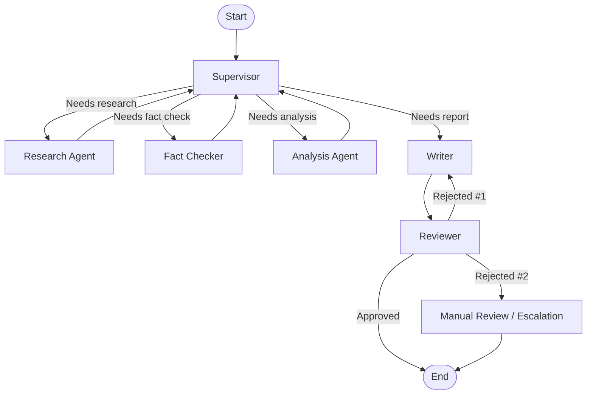

# Multi-Agent Workflow with LangGraph

## Project Overview

This project demonstrates a multi-agent AI workflow built
using LangGraph and Google Gemini.

The system receives a user question and passes it through
multiple specialized agents. Each agent performs a specific
task before the final report is generated.

## Multi-Agent Workflow


## Shared State Schema

All agents communicate through a shared `ResearchState`.

```text
┌───────────────────────────────────────────────┐
│                 ResearchState                 │
├───────────────────────────────────────────────┤
│ question        : str                         │
│ research        : str                         │
│ fact_check      : str                         │
│ analysis        : str                         │
│ final_report    : str                         │
│ review_feedback : str                         │
│ review_count    : int                         │
│ next_agent      : str                         │
└───────────────────────────────────────────────┘
```

The shared state allows each specialized agent to read information
produced by previous agents and add its own result.

The `review_count` field limits the automatic revision cycle and
prevents an infinite review loop.

## Reviewer and Rejection Handling

After the Writer creates the final report, the Reviewer evaluates it.

### If the report is approved

The workflow ends and the final report is accepted.

### If the report is rejected once

The Reviewer provides feedback and sends the report back to the Writer.

The Writer revises the report, and the revised report is sent to the
Reviewer again.

### If the report is rejected twice

The automatic revision cycle stops.

The report is sent to the Manual Review / Escalation stage instead of
being repeatedly sent back to the Writer.

This prevents an infinite revision loop and provides a clear stopping
condition for the workflow.
## Agents

### 1. Supervisor
Controls the workflow and decides which agent should run next.

### 2. Research Agent
Collects important information related to the user's question.

### 3. Fact Checker Agent
Reviews the research and identifies claims that may require
verification or have limitations.

### 4. Analysis Agent
Analyzes the research and identifies important insights,
conclusions, and practical implications.

### 5. Writer Agent
Combines the research, fact checking, and analysis to create
the final report.

## Technologies

- Python
- LangGraph
- LangChain
- Google Gemini
- python-dotenv
- Jupyter Notebook
- Anaconda

## Project Structure

multi-agent-langgraph/
|
|-- multi_agent_workflow.ipynb
|-- README.md
|-- requirements.txt
|-- .env
|-- .gitignore

## How It Works

1. The user provides a research question.
2. The Supervisor checks the current workflow state.
3. The Research Agent gathers information.
4. The Fact Checker Agent reviews the research.
5. The Analysis Agent analyzes the information.
6. The Writer Agent creates the final report.
7. LangGraph manages the workflow and shared state.

## Security

The Gemini API key is stored in a `.env` file.

The `.env` file is excluded from GitHub using `.gitignore`.

Never publish the API key in the source code or GitHub repository.

## Example Question

What are the applications of generative AI in education?

## Current Status

The LangGraph workflow, agents, routing logic, state
management, and project documentation have been implemented.

The final AI execution requires an available Gemini API quota.

## Future Improvements

- Add web-search tools for real-time research.
- Add source citations.
- Improve fact verification.
- Add parallel agent execution.
- Add a user interface.
- Add persistent conversation memory.